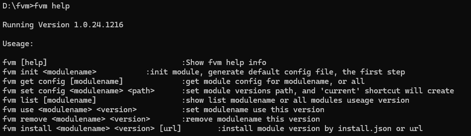

# fvm

## 说明

该工具目的是为了满足切换模块程序的版本，如 jdk、maven 等，在设置好模块的应用路径后，在该路径下生成 current 目录，并自动修改环境变量

## 原理

该工具读取配置的模块地址目录，查询目录下已有的文件夹，并认为这些文件夹是当前机器上可切换的版本，在使用 ``use <version>``` 后，可将该机器中该模块切换到指定版本

## 使用方法


